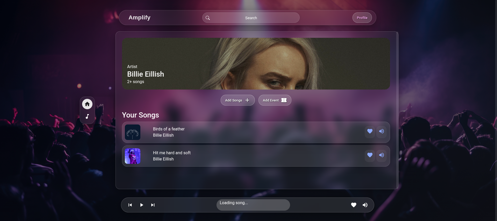
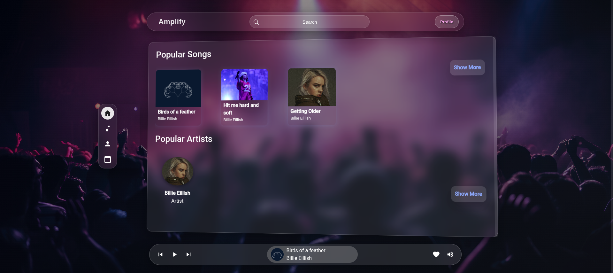
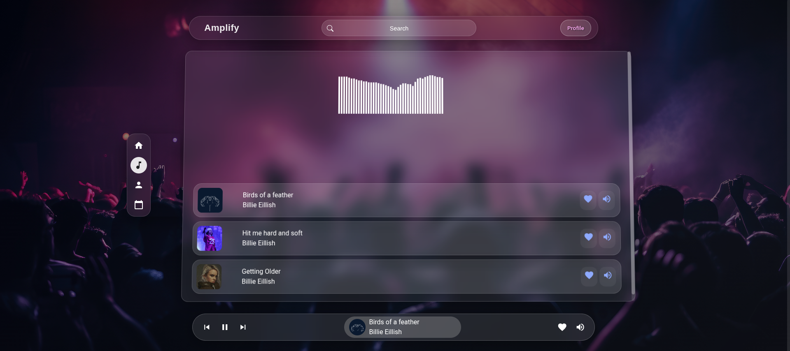

# 🎵 Amplify

**Amplify** is a music platform that connects artists and listeners.  
Artists can upload music and create events, users can listen to music and book tickets, and admins ensure quality through content approval.

---

## 👩‍🎤 Artist Features

Artists access a dedicated **Artist Dashboard**.

### 🎶 Upload Music
Artists can upload their music for review.

**Music Upload Includes:**
- Song title
- Genre
- Audio file (MP3/WAV)
- Cover image (optional)
- Description (optional)

🔒 Uploaded music is set to **Pending** until approved by an admin.

---

### 📅 Add Events
Artists can create events such as concerts or live shows.

**Event Details Include:**
- Event title
- Date & time
- Location
- Ticket price
- Number of tickets
- Description

🔒 Events are visible to users only after admin approval.

---

### 📊 Artist Dashboard UI
The Artist Dashboard allows artists to:
- Upload and manage music
- Create and manage events
- View approval status (Pending / Approved / Rejected)
- Edit or delete pending submissions
- View ticket bookings for approved events

---

## 👤 User Features

Users interact with Amplify through a clean and simple interface.

### 🎧 Listen to Music
Users can:
- Browse approved music
- Search by artist or genre
- Play music directly in the app
- View artist profiles

---

### 🎟️ Book Event Tickets
Users can:
- Browse approved events
- View event details
- Select number of tickets
- Book tickets securely

---

### 🖥️ User Interface (UI)

#### 🔹 Home Page
- Featured music
- Upcoming events
- Popular artists

#### 🔹 Music Page
- Music player
- Song list
- Genre filters
- Artist information

#### 🔹 Events Page
- Event cards
- Event details view
- Ticket booking interface

#### 🔹 User Profile
- Booking history
- Favorite music
- Account settings

---

## 🧑‍💼 Admin Features

Admins manage platform content through an **Admin Panel**.

### ✅ Content Moderation
Admins can:
- Review uploaded music
- Review created events
- Approve or reject submissions
- Provide feedback on rejected content

---

### 🛠️ Admin Dashboard UI
The Admin interface includes:
- List of pending music uploads
- List of pending events
- Music player for review
- Event detail preview
- Approve / Reject actions
- Content status management

---

## 🔄 Approval Workflow

1. Artist uploads music or adds an event
2. Status is set to **Pending**
3. Admin reviews the content
4. Content is:
   - **Approved** → Visible to users
   - **Rejected** → Returned to artist with feedback

---

## 🚀 Future Improvements
- Real-time notifications
- Artist performance analytics
- In-app messaging
- Ticket QR codes
- Dark mode UI

---

## 📌 Summary
Amplify provides a complete music ecosystem with:
- Artists creating content
- Admins moderating quality
- Users enjoying music and events

🎧 **Create. Share. Perform. Amplify.**
